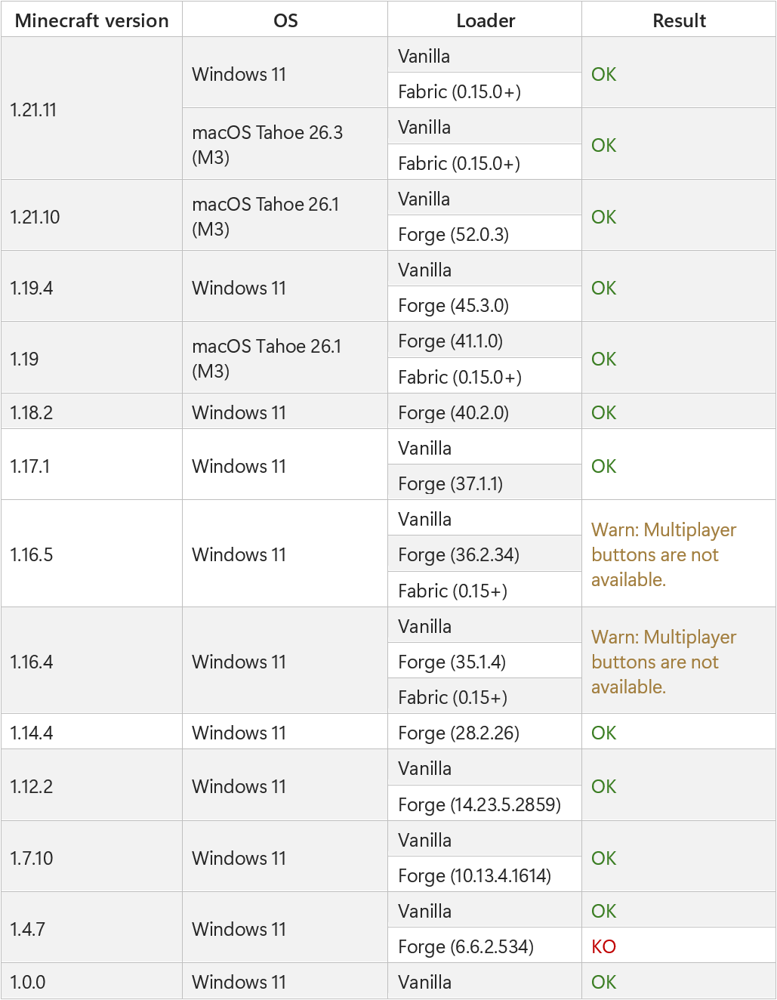

# Electron Minecraft Launcher Lib (EML Lib)

**Electron Minecraft Launcher Lib (EML Lib) is a Node.js library. It permits to authenticate, download Java and Minecraft and launch Minecraft.**

[](https://discord.gg/YVB4k6HzAY)
[](#platforms)
[](package.json)

<p>
<center>
  
</center>
</p>

---

## Features

- **Authentication**: Authenticate users with Microsoft, Azuriom or Crack.
- **Minecraft**: Automatically download and launch Minecraft (Vanilla, Forge [^1] and Fabric [^1], NeoForge, Quilt and MCP are coming soon), and remove unwanted files (such as unwanted mods).
- **Java**: Automatically download and install Java.
- **Bootstraps [^1]**: Auto-update your launcher.
- **Maintenance [^1]**: Block the launcher during maintenance.
- **Server status**: Displaying server information (from Minecraft 1.4 to the latest Minecraft version)
- **News [^1]**: Displaying news.
- **Background [^1]**: Displaying a background image.

## Installation

### Software requirements

- Node.js 20 or higher: see [Node.js](https://nodejs.org/);
- Electron 23 or higher: please install it with `npm i electron` _if you use Microsoft Authentication_.

To get all the capacities of this Node.js library, you must set up your [EML AdminTool](https://github.com/Electron-Minecraft-Launcher/EML-AdminTool-v2) website! Without it, you can only use Minecraft Vanilla, and many features will be disabled (such as News, Bootstrap, etc.).

If you don't want to use EML AdminTool, you should rather use the [Minecraft Launcher Core](https://npmjs.com/package/minecraft-launcher-core) library.

### EML Lib installation

You need [Node.js](https://nodejs.org) and [Electron](https://electronjs.org).

```bash
# Using npm
npm i eml-lib
```

`eml-lib` package includes TypeScript typings, so you don't need to install `@types/eml-lib`.

### Quick start

Quick start using the [EML AdminTool](https://github.com/Electron-Minecraft-Launcher/EML-AdminTool-v2):

```js
const EMLLib = require('eml-lib')

const launcher = new EMLLib.Launcher({
  url: 'https://admintool.electron-minecraft-launcher.com',
  serverId: 'eml',
  account: new EMLLib.CrackAuth().auth('GoldFrite')
})

launcher.launch()
```

Please refer to the [docs](https://emlproject.pages.dev/docs/set-up-environment) for more information.

## Platform compatibility

| OS (platform)              | Supported?     | Minimum version supported  |
| -------------------------- | -------------- | -------------------------- |
| Windows (win32)            | Yes            | Windows 7 (Windows NT 6.1) |
| macOS (Darwin)             | Yes            | Mac OS X Lion (10.7)       |
| Linux, including Chrome OS | Yes            | Variable                   |
| Others                     | Not officially | -                          |

> [!WARNING]
> Mac with Apple Silicon (M1, M2, etc.) is supported only for Minecraft 1.19 and above.

> [!WARNING]
> No support will be provided for older versions of Windows, macOS and Linux, or for other operating systems.

## Tests

The library has been tested on:



> [!WARNING]
> Minecraft versions below 1.19 are not supported on macOS with Apple Silicon (M1, M2, etc.).

> [!WARNING]
> Forge is not working on Minecraft 1.5.2 and below.

## Contributing

### Development

Download the code and run the commands:

```bash
cd EML-Lib-v2
npm i
```

### Tests

You can submit your tests by creating an issue.

Please indicate the following information in your issue:

- The Minecraft version;
- The operating system the test was performed on (including the version);
- The loader used (Vanilla, Forge, Fabric, etc., including the loader version);
- The result of the test (`OK` if the test was successful, `KO` if the test failed, or a detailed explanation if the test was not conclusive and if it breaks the game).

## Important information

- This is not an official library from Mojang Studios, Microsoft, Electron or Node.js. _Minecraft_ is a trademark of Mojang Studios.
- This Node.js library is under the `MIT` license; to get more information, please read the file `LICENSE`. It is legally obligatory to respect this license.
- If you need some help, you can join [this Discord](https://discord.gg/nfEHKtghPh).

<br>

[^1]: Requires [EML AdminTool](https://github.com/Electron-Minecraft-Launcher/EML-AdminTool-v2).
